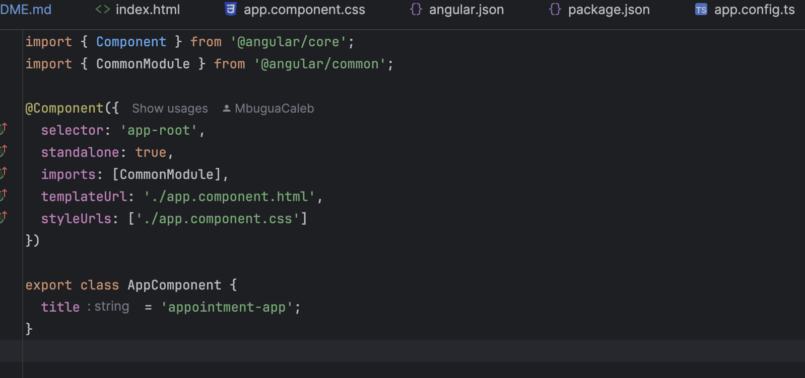

**Structure of Angular Application**

```
(a)SRC -->where i put in my components and add my application logic.

(b)Angular.json -->Where i make specific configurations through which i wish my application to run on.

(c)Package.json -->It contains and carries all the dependencies for my application.

(d)Other things are things that are typeScript Speicific.
  (Remember Angular runs on top of TypeScript)
  
```
**Component**

```
A compoment is the most basic part in an angular application.

it contains of three major parts:

  (i) the selector
  
  (ii) template URL -->Its html part
  
  (A component shows whatever is inside app-component.html)
  
  (iii)Style URL(s) --->The styling Part of that 
   Particular Component.
   
 (A component looks like what is specified in app.component.css)

It also has a part where i have my Javascript, which
can take in properties & javascript Objects, 
which i can use to render to my template.

```

**Component Diagram**



**One way binding**

```
Anything dynamic that needs to be displayed inside our html
in the angular component can be displayed and passed to that
component as a property.

Data Binding in Angular is a very Key Concept.

One way DataBinding is One Way of displaying our Property into
the HTML template.

Displaying data to our Angular Template is what we call biding.

{{message}}
 
Mostly used when i just want to display and thats It.

Double curly brances {{}}is the interpolation syntax that is used
to bind data to the template.

From the component to the Template

Two way data binding works Both Ways

```

**Angular Component**

```
we can be able to create a basic angular component 
from the CLI as follows,

ng g component appointment-list

```

**TypeScript**

```
TypeScript is a superset of JavaScript that adds static Types.

Ways of instantiating variables in typeScript,

var a:number
var a: string
var a:boolean
var app: AppComponent = new AppComponent();

var a: type[] -->typeArray
items:string[] =["one","two"]
var a:number[]
var a: string[]
var a:boolean[]
var app: AppComponent[]
N/B

this is mandatory in methods and variables in typeScript
when you want to access them within the Class,

```
**Models and Interfaces**

```
Anyform of data which i wish to represent in my 
application can be represented in form of a Model.

If i need to do any Operations eg getting it
an interface is best suited, since it can allow for multiple
implementations.

 //Interface is a Contract of How an Object specifically has to look like.
 It is not Optional
```
**Notes By**

```
MbuguaCaleb

```
